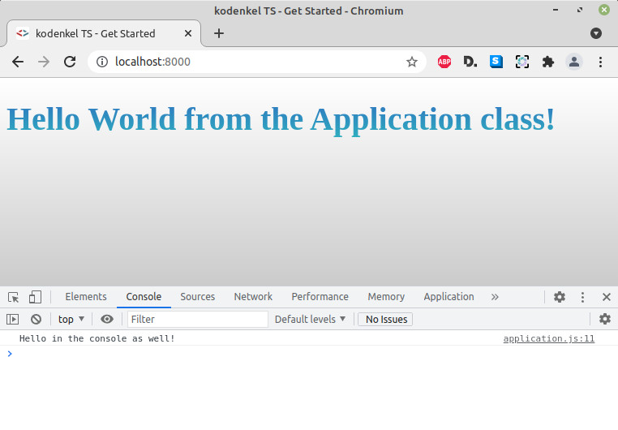

# kodenkel-typescript-showcase

This repository contains a minimal TypeScript web client application boilerplate/scaffold/skeleton/template (pick your choice of word).

I plan to update this repository in tandem with an upcoming tutorial on my blog over at:

https://www.kodenkel.com/tutorial/getting-started-with-typescript-frameworkless-browser-application

Please check out the tutorial, this readme is meant to be short.

For the time being feel free to browse, inspect and clone.



## Setup

To fully set up this project for local development, you need the following dependencies already installed:

- NPM (npmjs.com)

To set up the project the very first time:

````bash
chmod +x build.sh start-server.sh
npm install
./build.sh
````

Afterwards, simply compile the project with "build.sh".

Use your favorite web server to serve up static content from the /dist directory.

If you happen to have PHP installed, like me, just run the included shell script:

````bash
./start-server.sh
````

Then, navigate to "http://localhost:8000" in a browser.

## Entry point

Look at the TypeScript source in /app/Application.ts

Application is a singleton class. A constant instance is created in the same source file.

TypeScript transpiles our project and saves it in dist/application.js.

In dist/index.html (this is what we load in the browser, its in our document root) we simply require the compiled dist/application.js
